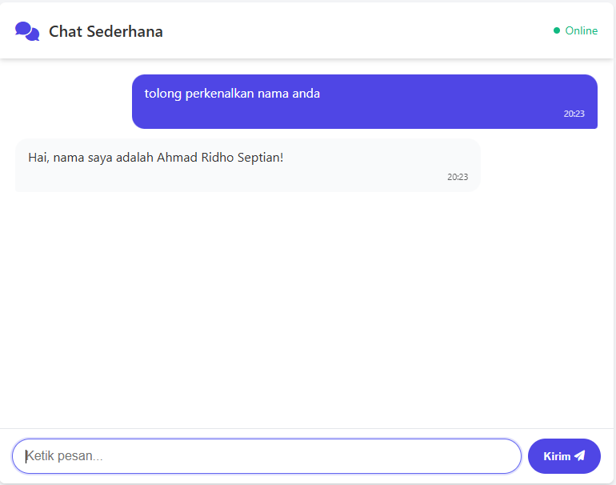

# 💬 Chat Real-Time Sederhana dengan WebSocket

## Deskripsi

Proyek ini adalah aplikasi chat real-time sederhana menggunakan **Node.js**, **Express.js**, dan **Socket.IO**. Aplikasi ini menunjukkan bagaimana WebSocket dapat digunakan untuk membangun komunikasi dua arah yang efisien antara client dan server.

Tujuan proyek ini adalah untuk memahami implementasi WebSocket secara langsung dalam aplikasi web modern.

---

## ✨ Fitur

- Komunikasi real-time antar pengguna
- Menggunakan WebSocket melalui Socket.IO
- Tampilan sederhana dan responsif

---

## 🛠️ Cara Instalasi dan Menjalankan

1. Clone repositori atau buat folder proyek baru.
2. Pastikan Node.js sudah terinstal di perangkat kamu.
3. Install dependencies:

```bash
npm install express socket.io
```

4. Struktur folder:

```
project-folder/
├── server.js
└── public/
    └── index.html
```

5. Jalankan server:

```bash
node server.js
```

6. Buka browser dan akses:

```
http://localhost:3000
```

Buka dua tab browser untuk mensimulasikan dua pengguna chatting secara real-time.

---

## 📷 Screenshot Demo

Tampilan aplikasi:

<p align="center">
 
 
</p>

---

## 📍 Demo Online

```

[chat-realtime-websocket](https://chat-realtime-websocket.up.railway.app)

```

---

## 📖 Teknologi yang Digunakan

- Node.js
- Express.js
- Socket.IO
- HTML5
- CSS3
- JavaScript

---

## 📅 License

This project is open source and free to use.

---

## 🌐 Referensi

- [Socket.IO Documentation](https://socket.io/docs/v4/)
- [MDN Web Docs - WebSocket API](https://developer.mozilla.org/en-US/docs/Web/API/WebSocket)
- [Express.js Official Site](https://expressjs.com/)
